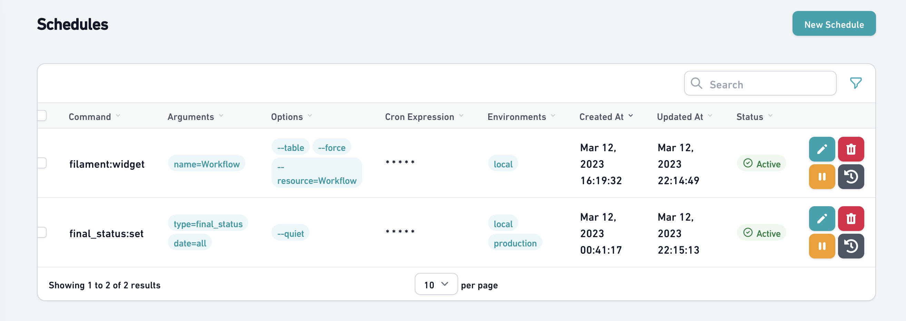
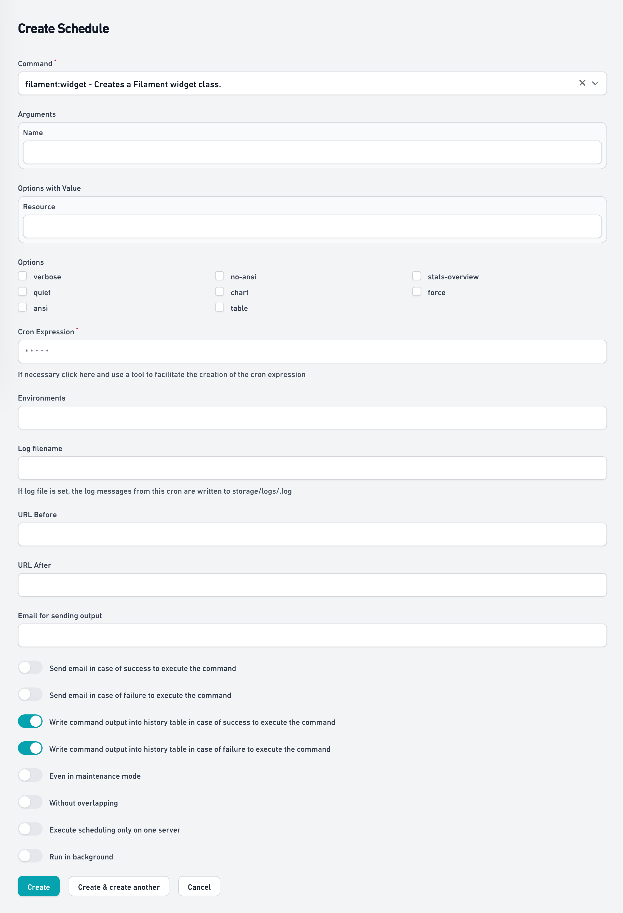
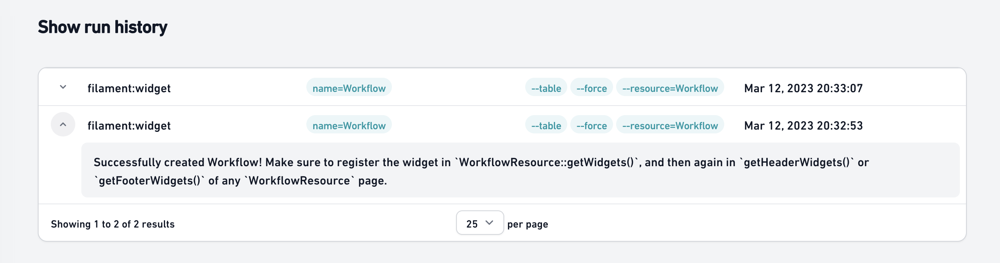

# Manage your Filament Task Scheduling in a Filament interface and save schedules to the database.

[](https://packagist.org/packages/husam-tariq/filament-database-schedule)
[](https://packagist.org/packages/husam-tariq/filament-database-schedule)




# Documentation

This librarian creates a filament resource(default: /schedule) in your filament admin panel where it is possible to manage which 
schedules will be executed at any given moment, these schedules are recorded in the database and can be changed, 
activated, inactivated or deleted via your panel without the need for a new application deployment.

## Create Schedules

## Show History Schedules


## Installation

You can install the package via composer:

```bash
composer require husam-tariq/filament-database-schedule
```

You should publish and run the migrations with:

```bash
php artisan vendor:publish --tag="filament-database-schedule-migrations"
php artisan migrate
```

You can publish the config file with:

```bash
php artisan vendor:publish --tag="filament-database-schedule-config"
```

You can publish the translations files with:

```bash
php artisan vendor:publish --tag="filament-database-schedule-translations"
```

Run the artisan command to run scheduled tasks
```bash
php artisan schedule:run
```

### Plugin Usage
Using the plugin is easy all you need to do is instanciate it to the Panels you want the plugin to be available in.

```php
use HusamTariq\FilamentDatabaseSchedule\FilamentDatabaseSchedulePlugin;


public function panel(Panel $panel): Panel
{
    return $panel
        ...
        ->plugins([
           FilamentDatabaseSchedulePlugin::make()
        ])
        ...
}
```

### Environment variables

You can set the following environment variables to configure schedules:

* SCHEDULE_TIMEZONE : The default is the same configured for the application, but if you need the schedules to run in a different timezone, it is possible to configure it with this variable
* SCHEDULE_CACHE_DRIVER : The default is `file`
* SCHEDULE_CACHE_ENABLE : The default is disabled when `APP_DEBUG=true` and enabled when `APP_DEBUG=false`

## Changelog

Please see [CHANGELOG](CHANGELOG.md) for more information on what has changed recently.

## Contributing

Please see [CONTRIBUTING](.github/CONTRIBUTING.md) for details.

## Security Vulnerabilities

Please review [our security policy](../../security/policy) on how to report security vulnerabilities.

## Credits

- [Hussam Tariq](https://github.com/husam-tariq)
- [All Contributors](../../contributors)

## License

The MIT License (MIT). Please see [License File](LICENSE.md) for more information.
